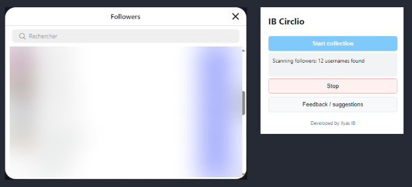
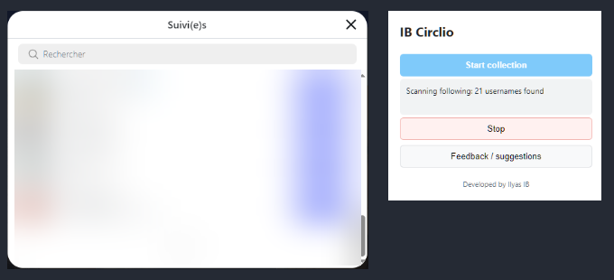
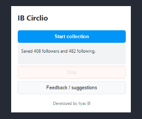
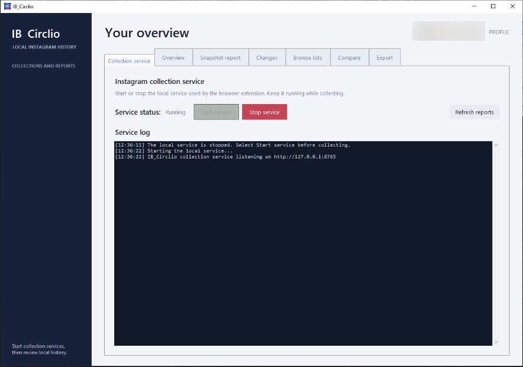
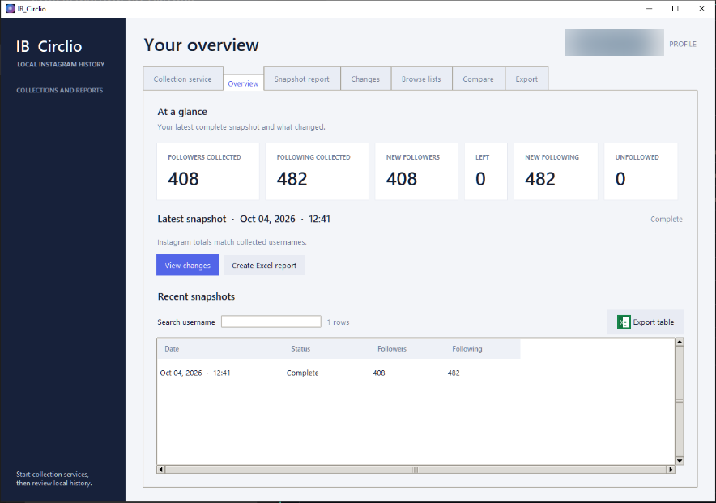
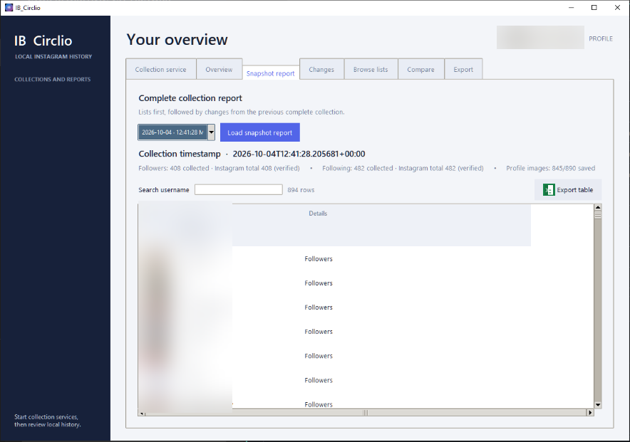
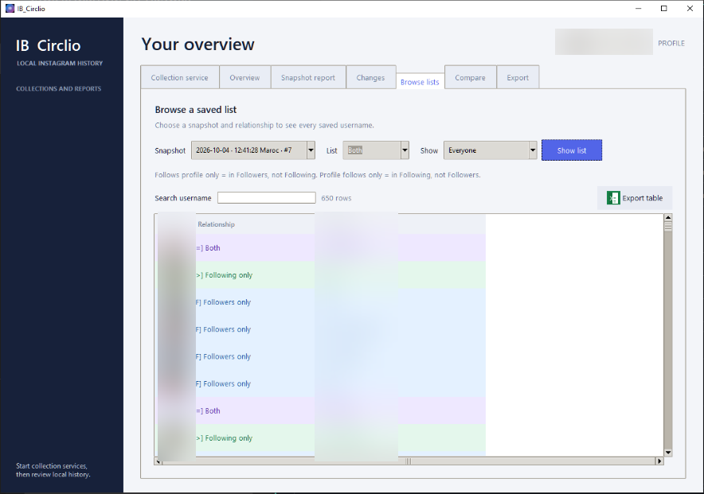
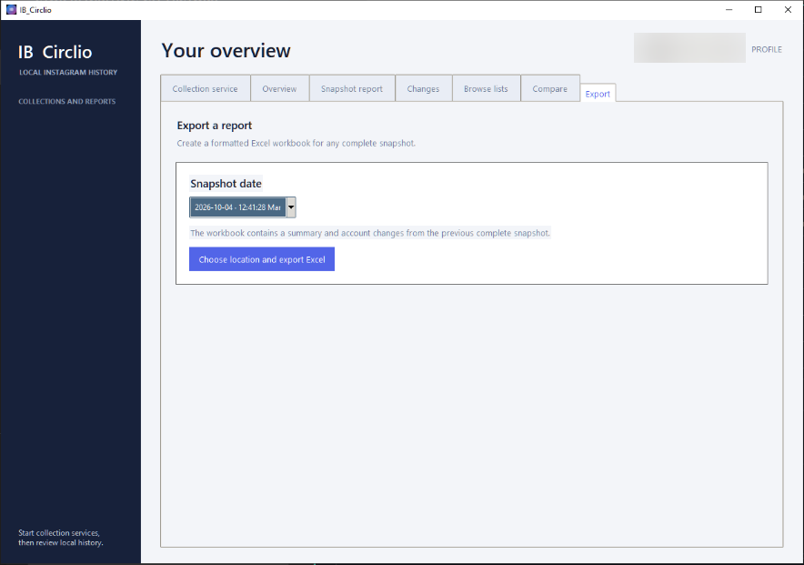
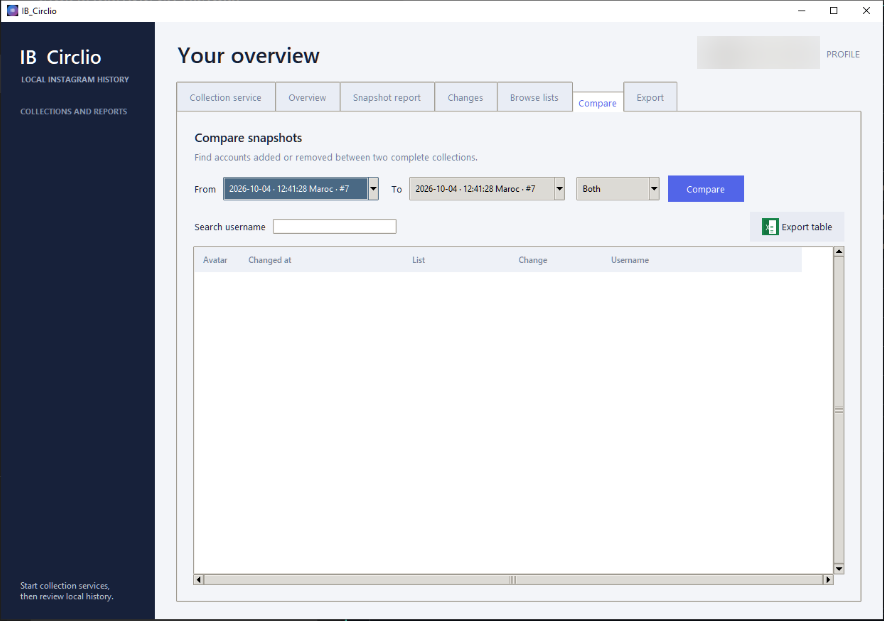
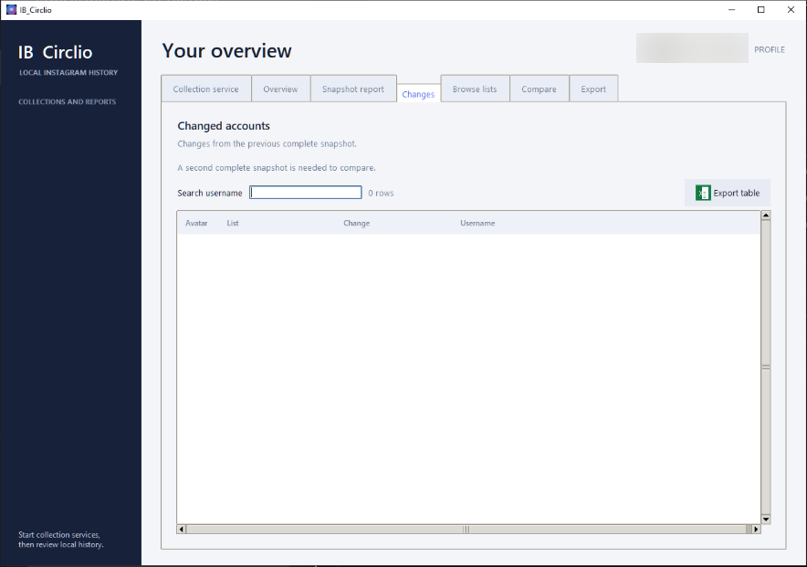

# IB_Circlio

**A Windows application and browser extension for collecting Instagram follower and following snapshots, comparing changes over time, and exporting local reports.**

IB_Circlio keeps timestamped snapshots of the follower and following lists visible on an Instagram profile. It compares those snapshots to show which usernames appeared or disappeared between collections, and can also record profile-picture versions when Instagram exposes an image in a list row.

The project combines a browser extension with a small Python service and a desktop report application. Collection history, change records, and downloaded profile pictures are stored on the user's PC in SQLite and local files; IB_Circlio does not provide a cloud account or hosted data service. It is intended for people who want to review changes in lists available to their signed-in browser and keep their own local history.

> IB_Circlio can report only what it successfully collected. It cannot recover changes from before the first snapshot, guarantee that Instagram rendered every account, or access information unavailable to the signed-in browser.

[](https://github.com/xxkyser-ctrl/IB_Circlio/releases/latest)

## Overview

Instagram's current follower and following lists do not provide a personal, timestamped history of every account shown. IB_Circlio lets a user collect those lists periodically and compare saved snapshots, so a later report can show additions, removals, and the collection time at which each observed transition occurred.

The main workflow is:

1. Open an Instagram profile while signed in through a supported browser.
2. Start a collection from the IB_Circlio extension. It reads the profile's visible Followers and Following dialogs.
3. The extension sends the usernames and any available image URLs to the local service running on the same PC.
4. The service stores the snapshot, calculates changes from the previous complete snapshot, and attempts to archive available profile pictures.
5. Use the desktop report application to browse, search, compare, and export saved data.

Each collection is an observation, not a live connection to Instagram. A first complete collection establishes a baseline; subsequent complete collections can be compared with it. Partial collections are retained for inspection but are not used as complete comparison baselines.

## Key features

- **Collect both lists in one run.** The extension opens and scans the profile's Followers and Following dialogs, waits at least one second for each dialog to stabilize, and scrolls to discover usernames the page loads as it goes.
- **Keep a local, timestamped history.** Complete and partial snapshots are saved in a SQLite database on the PC. Usernames are normalized and de-duplicated within each list.
- **See follower and following changes.** Compare snapshots to find accounts added to or removed from each relationship list.
- **Trace changes between any two snapshots.** The comparison view can show every recorded transition between an older **From** snapshot and a newer **To** snapshot, including an account that left and later returned.
- **Browse and search saved lists.** View Followers, Following, or Both for a snapshot. Search fields filter table rows without changing the saved data.
- **Review profile-picture history.** When a usable image URL is visible, IB_Circlio downloads a local copy for that collection. The report can display archived pictures, open an available picture at a larger size, and identify changed image URLs between collections.
- **Export Excel workbooks and table views.** Create a formatted `.xlsx` report for a snapshot or export the currently displayed rows of an individual report table.
- **Refresh reports automatically.** While the local collection service is running, the desktop app detects saved database changes and updates the report views; manual refresh is still available.
- **Check collection totals.** The report distinguishes the number of usernames actually saved from Instagram's displayed header totals. A displayed total is marked unverified when it cannot be validated against the collected list.
- **Review multiple profiles.** Collections are grouped by the Instagram profile whose list was collected.

## How it works

### Collection and reporting flow

1. **User input:** the user signs in to Instagram in their browser, navigates to a profile, and starts collection in the extension.
2. **Browser-side reading:** `content.js` locates the visible profile list dialogs, reads usernames and available image URLs from their rendered links and rows, and scrolls the dialog while Instagram loads more entries. It collects Followers and then Following.
3. **Extension messaging:** `popup.js` provides the start/stop controls and progress display. `background.js` sends messages between the popup and content script and makes authenticated requests to the local service.
4. **Local API and persistence:** `server.py` validates and normalizes the collection, stores the collection and its list memberships in SQLite, calculates membership changes from the previous complete snapshot for that profile, and downloads supported profile-picture URLs where possible.
5. **Results:** `result_gui.py` reads the local database and presents overview, snapshot, changes, browse, compare, and export views. `result.py` provides command-line reporting and writes `.xlsx` workbooks.

The extension reads the Instagram page as rendered in the user's browser; it does not use Instagram API credentials or request the user's Instagram password. Image downloads are made from image URLs supplied by the page. Instagram's own site remains an external service used by the browser.

### Architecture

```text
 Instagram profile in browser
       |
       +--> content.js reads Followers and Following dialogs
       |                      |
       |                      v
       +--> popup.js <--> background.js
                              |
                              | HTTP + local token (127.0.0.1:8765)
                              v
                     server.py (local API)
                        /           \
                       v             v
             SQLite database     Local avatar files
                       \             /
                        v           v
                    result_gui.py (desktop reports)
                              |
                    Compare, browse, export
                              |
                         Excel .xlsx
```

The desktop app starts and stops the local service and reads the same local database for reports. The service listens on the loopback interface (`127.0.0.1`), not on a public network interface. The default local data directory is `%USERPROFILE%\Desktop\Instagram Exporter Data`.

## Tech stack

| Technology | Purpose |
|---|---|
| JavaScript | Browser extension popup, background worker, and Instagram page content script |
| HTML and CSS | Extension popup interface |
| Python 3 | Local HTTP service, SQLite access, command-line reports, desktop application, and packaging scripts |
| SQLite (`sqlite3`) | Local profile, collection, membership, change, and avatar metadata storage |
| Tkinter / `ttk` | Windows desktop reporting interface |
| Pillow | Avatar display, resizing, and desktop report visuals |
| ZIP/XML using Python standard library | `.xlsx` workbook creation in the command-line reporting module |
| PyInstaller | Building portable Windows executables |
| Instagram website | Source of the profile lists and any image URLs exposed in the browser |

IB_Circlio does not use a hosted application backend, a hosted database, or Instagram API credentials.

## Project structure

```text
IB_Circlio/
├── .gitignore                  # Excludes Python bytecode caches and local data
├── background.js              # Extension worker and local API requests
├── content.js                 # Reads and scrolls Instagram list dialogs
├── popup.html                 # Extension popup markup
├── popup.js                   # Start/stop controls and collection status
├── manifest.json              # Chromium extension manifest
├── manifest.firefox.json      # Firefox-specific manifest
├── server.py                  # Local HTTP API and SQLite persistence
├── result_gui.py              # Tkinter desktop reports
├── result.py                  # Command-line reports and Excel workbook writer
├── launcher.py                # Creates the local token and extension config
├── ib_circlio.bat             # Single source-mode launcher for the unified app
├── clear_database.bat         # Starts the local data-reset utility
├── clear_database.py          # Password-confirmed database and avatar reset
├── build_release.py           # Builds isolated, versioned Windows release outputs
├── requirements-build.txt      # Python packaging and image-library dependencies
├── config.template.js          # Manual configuration template (placeholder token)
├── SECURITY.md                # Security model and release checklist
├── RELEASE_NOTES.md           # Current release notes
├── docs/screenshots/          # Privacy-redacted application and workflow screenshots
└── icons/                      # Extension and Windows application icons
```

The root directory is the extension source folder. The portable release includes one user-facing launcher, `ib_circlio.exe`, plus supporting service and database-reset executables. `build/`, `dist/`, and `release/` are packaging outputs rather than required runtime source directories.

## Installation

### Portable Windows release

The portable release includes the extension source files and Windows executables, so Python is not needed for normal use.

1. Download the latest `IB-Circlio-<version>-windows.zip` from [GitHub Releases](https://github.com/xxkyser-ctrl/IB_Circlio/releases/latest) and extract it to a normal folder. Keep the extracted files together.
2. In a Chromium-based browser, open its extensions page:
   - Chrome: `chrome://extensions`
   - Microsoft Edge: `edge://extensions`
   - Brave: `brave://extensions`
   - Opera: `opera://extensions`
   - Vivaldi: `vivaldi://extensions`
3. Enable **Developer mode**, select **Load unpacked**, and choose the extracted release folder.
4. Double-click `ib_circlio.exe` to open the IB_Circlio desktop application. The app creates the local data directory, token, and extension configuration. In its **Collection service** tab, select the green **Start service** button and confirm the status changes to **Running**.
5. Sign in to Instagram normally, open the profile whose lists you want to collect, and click the IB_Circlio extension.
6. Select **Start collection**. The extension reads Followers and Following in sequence and reports when the snapshot is saved.
7. Return to the same IB_Circlio window to browse, compare, search, and export saved collections. Reports refresh automatically while the service is running; **Refresh reports** remains available for a manual reload. Select the red **Stop service** button when finished; closing the app also stops its service.

The repository includes a Firefox-specific manifest. Firefox extension origins are not included in the local service's current explicit origin allowlist; therefore, end-to-end Firefox collection is not documented as a supported workflow. The Chromium-based browsers above use the standard manifest and are the intended installation path.

### Install from source

Prerequisites:

- Windows for the supplied batch files and supported portable Windows build.
- Python 3.13 or newer for the documented source and release-build workflow.
- A supported Chromium-based browser and access to Instagram in that browser.
- Git to clone the repository.

Clone the repository and install the Python packages used by the desktop interface and release builder:

```powershell
git clone https://github.com/xxkyser-ctrl/IB_Circlio.git
Set-Location IB_Circlio
py -3 -m pip install -r requirements-build.txt
```

The source folder can be loaded as an unpacked browser extension. Open the integrated desktop application from the source folder:

```powershell
.\ib_circlio.bat
```

The single launcher starts the unified interface, which can start the local service and show its status and logs. It uses the packaged executable when present and otherwise uses Python source scripts. To run the interface directly from source:

```powershell
py -3 -B result_gui.py --data-dir "$env:USERPROFILE\Desktop\Instagram Exporter Data"
```

Use `py -3 -B` for direct Python commands from the source folder to avoid creating `__pycache__` directories.

To run the test suite:

```powershell
py -3 -B -m unittest -q
```

To build the portable Windows package from source:

```powershell
py -3 -B build_release.py
```

The build script requires Windows and the packages in `requirements-build.txt`. It creates version-specific build files under `build/IB Circlio-1.0.6-windows/` and the portable app under `release/IB Circlio-1.0.6-windows/` without deleting other release or build output. Run Python with `-B` (as in the command above) to prevent bytecode cache files from being written into the source folder.

## Environment variables and configuration

IB_Circlio does not load a `.env` file and does not require external API keys. The service reads the following optional variables from its process environment when started directly:

| Variable | Purpose | Required |
|---|---|---|
| `INSTAGRAM_PORT` | Local service port; defaults to `8765`. | No |
| `INSTAGRAM_DB` | SQLite database file path; defaults to `%USERPROFILE%\Desktop\Instagram Exporter Data\instagram.db` on Windows. | No |
| `INSTAGRAM_EXPORTER_TOKEN` | Local API token; must be at least 32 characters and contain no whitespace. | Required for a direct service start unless `--token-file` is supplied |

The desktop application creates a persistent token in `server-token.txt` under the local data directory and writes the ignored `config.js` used by the extension. The extension connects to `http://127.0.0.1:8765` by default. Changing the service port requires matching changes to the extension configuration and browser host permissions; it is not a normal end-user setting.

For manual development configuration, `config.template.js` shows the required JavaScript variable names with a placeholder. Do not use the placeholder token to run the service.

## Running locally

For normal use, open the integrated application:

1. Start `ib_circlio.exe` from a portable release, or `ib_circlio.bat` from the source folder.
2. Open the **Collection service** tab and select the green **Start service** button. The status and service output are shown in the application.
3. Open Instagram and use the extension to collect a profile.
4. Return to the desktop application to browse, compare, and export using the report tabs. Reports refresh automatically while the service runs; use **Refresh reports** for a manual reload. The red **Stop service** button stops the backend; closing the app stops it as well.

To erase locally saved collection history and archived avatars, stop the service, close the desktop app, and use the password-protected [local data reset utility](#clearing-local-collection-data).

Select the red **Stop service** button in the application when collection is finished. Closing the application also stops the service it started. Avoid running a second service instance against the same data directory.

## Usage

### Make a useful comparison

1. Run a first complete collection for a profile. This is the baseline; it cannot show changes from before that collection.
2. Return later and collect the same profile again.
3. In the report app, select the profile and open **Changes** to review differences from the previous complete collection.
4. Open **Compare**, choose the older snapshot as **From** and the newer snapshot as **To**, and compare Followers, Following, or both. The timeline reports transitions at the collection timestamp when each transition was observed.
5. Use **Browse lists** to inspect a snapshot's Followers, Following, or combined membership. Search the table by username as needed.
6. Use a table's **Export table** action to export the displayed rows, or use **Export** / **Create Excel report** for a full snapshot workbook.

In **Browse lists**, choose **Both** and then use **Show** to filter the combined list to **Follows profile only** (in Followers but not Following), **Profile follows only** (in Following but not Followers), or **Mutual follows**. A missing avatar means an image was not available to the collector or could not be downloaded at that collection time.

## API

The local service's default base URL is `http://127.0.0.1:8765`. It is a local extension interface, not a public or hosted API. Except for the health check and CORS preflight, routes require an `Authorization: Bearer <token>` header and accept requests only when the request origin is absent or matches the service's Chrome-extension origin rule.

| Method | Path | Parameters / body | Result |
|---|---|---|---|
| `GET` | `/api/health` | None | `200`, `{"ok":true,"service":"instagram-exporter"}`. No token is required. |
| `GET` | `/api/collections/latest` | Query: `profile=<username>` | `200`, `{"ok":true,"collection":...}`; `collection` is `null` when none exists. |
| `GET` | `/api/collections/history` | Query: `profile=<username>` | `200`, `{"ok":true,"collections":[...]}` in newest-first order. |
| `POST` | `/api/collections` | JSON collection body (example below) | `201`, `{"ok":true,"collection":...}`. Request bodies are limited to 25 MiB. |
| `DELETE` | `/api/collections?profile=<username>` | Query: `profile=<username>` | `200`, `{"ok":true,"profile":"<username>"}`; deletes that profile's database records. Archived image files are not deleted by this route. |

A collection request uses these fields:

```json
{
  "profile": "example",
  "followers": ["alice"],
  "following": ["bob"],
  "avatars": {},
  "headerTotals": {
    "followers": 1,
    "following": 1
  },
  "headerTotalLabels": {
    "followers": "1 follower",
    "following": "1 following"
  },
  "complete": true
}
```

`profile` is the profile whose lists were collected; `followers` and `following` are username arrays; `avatars` maps usernames to image URLs; `headerTotals` and `headerTotalLabels` retain the totals read from the profile page; and `complete` indicates whether both lists were fully collected. Avatar URLs are optional. Invalid profiles and request bodies return `400`; unauthorized requests return `401`; rejected origins return `403`; unknown paths return `404`. Responses are JSON objects with an `ok` field and, on error, an `error` message.

The API also handles `OPTIONS` preflight requests for permitted origins. The extension uses the API internally; end users normally interact with the extension and desktop application rather than calling these routes directly.

## Database

IB_Circlio uses Python's built-in `sqlite3` module. By default, `instagram.db` is stored in:

```text
%USERPROFILE%\Desktop\Instagram Exporter Data\instagram.db
```

The service creates the schema when it opens the database and applies a small set of additive column upgrades for older database files. There is no separate migration command or migration framework.

| Table | Purpose |
|---|---|
| `profiles` | One row for each Instagram profile whose lists have been collected. |
| `users` | Normalized usernames shared across saved collections. |
| `collections` | Snapshot timestamp, completion status, profile, and Instagram header totals/labels. |
| `collection_memberships` | The Followers and Following memberships recorded for each snapshot. |
| `membership_changes` | Accounts added to or removed from a relationship list in a collection, relative to the previous complete snapshot. |
| `avatar_cache` | The most recent cached avatar file and source URL for a username. |
| `collection_avatar_versions` | The avatar file, source URL, and fetch time associated with a particular collection. |

Each profile can have many collections. A collection records its memberships through `collection_memberships`, which links the shared `users` rows to the collection and relationship type. `membership_changes` records additions and removals for that collection. Avatar records link usernames and collections to local image files. Memberships and change history are stored in SQLite; image files are stored separately in an `avatars` subfolder beside the selected database. The database and image archive are not encrypted by IB_Circlio.

## Clearing local collection data

Use the reset utility only when you intend to permanently erase the locally collected history. Stop the collection service and close the IB_Circlio desktop app first.

- From a source checkout, run `clear_database.bat`.
- From a portable release, run `clear_database.bat` or `ib-circlio-clear-database.exe`.
- From a source command prompt, run `py -3 -B clear_database.py --data-dir "$env:USERPROFILE\Desktop\Instagram Exporter Data"`.

The first run asks you to create and confirm a separate clear password. The utility stores a salted password hash in `clear-password.txt` under the data directory. Later runs require that password. Every run also requires the exact confirmation `CLEAR`; any other response cancels the reset.

After confirmation, the utility deletes the saved profiles, collections, memberships, recorded changes, and archived avatar files. This is permanent and there is no undo. It does not delete the database file itself, the clear-password file, the service token or extension configuration, or Excel workbooks you previously exported. Keep backups of anything you may need.

## Screenshots and demo

The repository contains privacy-redacted screenshots of collection and the report tabs. Usernames, profile photos, and surrounding browser content are obscured or omitted:





















## Configuration

- **Database and pictures:** stored beneath `%USERPROFILE%\Desktop\Instagram Exporter Data` by default.
- **Server authentication:** the desktop application creates a random token locally and writes the extension configuration to the ignored `config.js`.
- **Service address:** the local service binds to `127.0.0.1:8765` by default.
- **Alternate data directory:** `ib_circlio.bat`, `result_gui.py`, `server.py`, and related scripts accept command-line paths for source/development workflows; the portable executable uses the default Windows data directory.
- **Data reset:** `clear_database.bat` starts the password-confirmed utility. It requires confirmation by typing `CLEAR` before permanently clearing profiles, snapshots, changes, and archived pictures.

## Deployment

IB_Circlio is designed to run locally on Windows. The repository contains a Windows packaging script that creates portable executables and a release folder; it does not define a hosted deployment, cloud service, or public API deployment process.

## Troubleshooting

- **The extension reports that it cannot reach the database:** open the IB_Circlio application, select the green **Start service** button, and confirm the status is **Running**. Confirm that the extension was loaded from the extracted folder and that its local configuration was created.
- **The extension does not respond on an Instagram tab that was already open:** reload the Instagram tab after installing or updating the extension.
- **The extension reports that a list dialog did not open:** open a profile page, allow it to finish rendering, and try again. If necessary, open the Followers or Following count once manually and retry.
- **A collection is partial or appears short:** Instagram loads list content dynamically and may rate-limit or change its page markup. Keep the tab open during collection and retry later. Partial collections are saved for inspection but excluded from complete-snapshot comparisons.
- **A displayed total is unverified:** the page total was unavailable or did not match the distinct usernames saved. The report shows the collected count separately; treat that as the number stored in the snapshot.
- **Profile pictures are missing:** Instagram may not expose an image URL in a list row, or the URL may not be downloadable. Images are best-effort and are not reconstructed later if they were not archived.
- **The service cannot bind to its port:** another process may already be using port `8765`. Read the error in the **Collection service** log and close the other service instance before starting another. A custom port also needs matching extension configuration and host permissions.
- **No changes appear in the report:** the first complete snapshot is a baseline. Collect at least one later complete snapshot and compare the correct profile and dates.
- **The report window does not start from source:** use a Windows Python installation that includes Tkinter and install `requirements-build.txt` so Pillow is available. The portable release supplies the application executable.
- **The desktop app shows no profile:** confirm that the service and desktop app use the same data directory and that at least one collection has been saved.

## Security and privacy

- IB_Circlio does not ask for or store an Instagram password and does not use Instagram API credentials.
- The local service binds to `127.0.0.1`, uses a random bearer token for data routes, and restricts browser-origin access to its configured extension origin rule.
- The application does not upload collection history to an IB_Circlio cloud service. The browser accesses Instagram, and the service may request profile-picture URLs that the page exposed.
- The SQLite database, local token, archived profile pictures, and exported workbooks are sensitive. They are not encrypted by the application; protect your Windows account and backups.
- Do not publish `config.js`, `server-token.txt`, database files, exported workbooks, or screenshots containing real usernames.
- Stop the local service when it is not in use. See [SECURITY.md](SECURITY.md) for the repository's security model and release checklist.

## Limitations

- Results are limited to accounts visible to the signed-in browser and usernames the page exposes while the dialogs are scanned. Instagram may change its markup, pagination, or rate limits.
- Collection scans use a safety limit and depend on Instagram's dynamically rendered list. A successful run is not proof that Instagram exposed every account.
- Historical changes before the first saved snapshot cannot be inferred.
- A transition is observed at a collection time; the exact time an account changed its relationship is unknown.
- Avatar capture is best-effort. It depends on Instagram exposing a usable image URL and the image being downloadable at collection time.
- Archived usernames, images, and exported reports remain on the local PC until the user deletes them.
- The Firefox manifest is included, but the local service currently has an explicit Chrome-extension-origin allowlist; use the Chromium-based browsers documented above for the intended workflow.
- IB_Circlio is an independent project and is not affiliated with, endorsed by, or sponsored by Instagram or Meta.

## Roadmap

No formal roadmap is recorded in the repository. No versioned roadmap is inferred here.

## License

No `LICENSE` file is present in the repository. No license grant is stated here.

## Author

Solo-developed and maintained by [@xxkyser-ctrl](https://github.com/xxkyser-ctrl).

## Project links

- [Source code and releases](https://github.com/xxkyser-ctrl/IB_Circlio)
- [Latest Windows download](https://github.com/xxkyser-ctrl/IB_Circlio/releases/latest)
- [Questions and bug reports](https://github.com/xxkyser-ctrl/IB_Circlio/issues)
- [Security policy](SECURITY.md)
