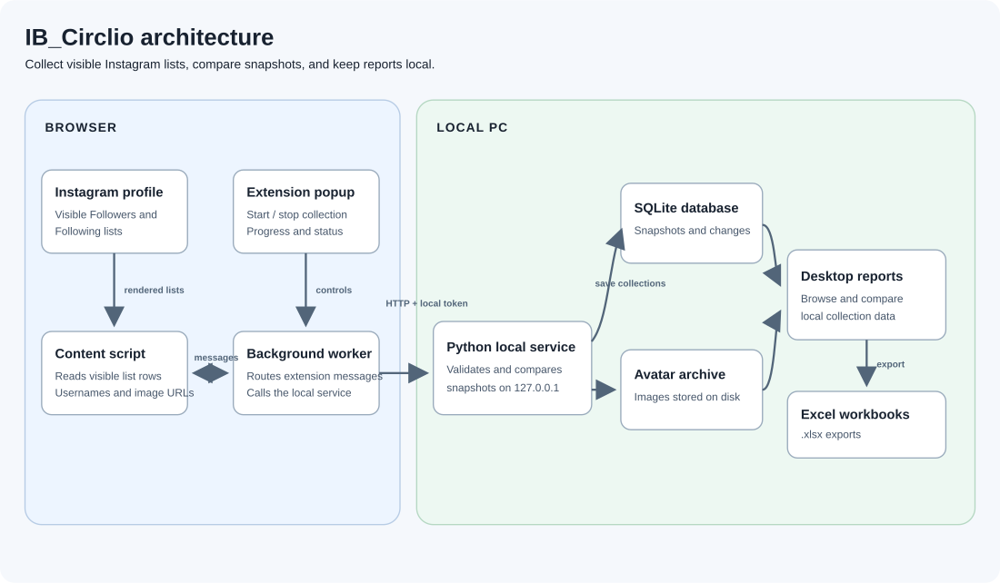

# IB Circlio

**A local-first Windows app and browser extension for tracking Instagram follower and following lists over time.**

[](https://github.com/xxkyser-ctrl/IB_Circlio/releases/latest)
[](#installation)

IB Circlio collects the Followers and Following lists visible on a profile in your signed-in browser, saves timestamped snapshots to your PC, and helps you review changes and export reports. Collection history stays on your PC; IB Circlio has no cloud account or hosted data service. `IB_Circlio` is the repository and project-site identifier.

[Project website](https://xxkyser-ctrl.github.io/IB_Circlio/) · [Latest release](https://github.com/xxkyser-ctrl/IB_Circlio/releases/latest) · [Source code](https://github.com/xxkyser-ctrl/IB_Circlio)

## What it does

- Collects Followers and Following from the profile lists rendered in Instagram, scrolling as the page loads more accounts.
- Saves complete and partial collections locally. A first complete collection is the baseline; later complete collections can show accounts added to or removed from either list.
- Lets you browse and search saved lists, compare any two complete snapshots, and review changes at the collection times they were observed.
- Shows overview totals, relationship categories, and best-effort profile-picture history when image URLs are available.
- Exports a formatted Excel workbook for a snapshot or the currently displayed rows of a report table.

Collection results reflect what Instagram exposed to the browser during that run. They are not a live feed, and cannot reveal changes from before the first snapshot or the exact time a relationship changed.

## Screenshots

These existing, privacy-redacted screenshots show example data.

| Desktop overview | Collection complete |
|---|---|
|  |  |

| Browse a saved list | Export a report |
|---|---|
|  |  |

## How it works

1. Start the IB Circlio desktop app and its local collection service.
2. Open an Instagram profile in a supported Chromium-based browser and start a collection from the extension.
3. The extension reads usernames and any available image URLs from the visible Followers and Following dialogs, then sends the results to the local service.
4. The service saves a timestamped snapshot and calculates changes against the previous complete snapshot for that profile.
5. Browse, compare, and export the saved data in the desktop reports.

The service listens on `127.0.0.1` and stores data on the same PC. The desktop application reads that local data to prepare reports.



## Installation

IB Circlio is intended for Windows. The latest published portable package is available from [GitHub Releases](https://github.com/xxkyser-ctrl/IB_Circlio/releases/latest). The portable app does not require a separate Python installation.

1. Download and extract the latest Windows ZIP.
2. Start `ib_circlio.exe`.
3. In the **Collection service** tab, select **Start service**.
4. In a Chromium-based browser, open the extensions page, enable developer mode, and load the extracted folder as an unpacked extension.
5. Open an Instagram profile, select the IB Circlio extension, and start a collection.
6. Return to the desktop app to browse, compare, and export your snapshots.

Keep the extracted release folder in place while the extension is installed; the browser loads the extension files from that folder. Reload an Instagram tab that was already open after installing or updating the extension. Stop the service when finished, or close the desktop app to stop the service it started.

> A Firefox manifest is included in the repository, but the local service currently allows the configured Chrome-extension origin. The documented end-to-end workflow is for Chromium-based browsers.

## Development

### Requirements

- Windows
- Git
- Python 3.13 or later
- A Chromium-based browser for extension testing

### Set up and run from source

```powershell
git clone https://github.com/xxkyser-ctrl/IB_Circlio.git
Set-Location IB_Circlio
py -3 -m pip install -r requirements-build.txt
.\ib_circlio.bat
```

Load the repository folder as an unpacked extension. Start the local service from the desktop app, then use the extension on Instagram.

To launch the report application directly with an explicit data directory:

```powershell
py -3 -B result_gui.py --data-dir "$env:USERPROFILE\Desktop\Instagram Exporter Data"
```

Run the tests and build the portable Windows package with:

```powershell
py -3 -B -m unittest -q
py -3 -B build_release.py
```

The build uses `requirements-build.txt` and writes version-specific output beneath `build/` and `release/`. The `-B` option prevents Python bytecode cache files from being written into the source tree.

### Project structure

| Path | Purpose |
|---|---|
| `background.js`, `content.js`, `popup.js`, `popup.html` | Browser extension collection workflow |
| `server.py`, `launcher.py` | Local API, SQLite persistence, and application startup |
| `result_gui.py`, `result.py` | Desktop reports, command-line reporting, and workbook export |
| `clear_database.py`, `clear_database.bat` | Confirmed local-data reset utility |
| `manifest.json` | Chromium extension manifest |
| `manifest.firefox.json` | Firefox manifest; see the compatibility note above |
| `test_server.py`, `test_result.py` | Automated tests |
| `docs/` | Project website, architecture diagram, and existing screenshots |

## Local data and privacy

- By default, the SQLite database and archived profile pictures are stored under `%USERPROFILE%\Desktop\Instagram Exporter Data`. The database file is `instagram.db`; pictures are stored in an `avatars` subfolder.
- The extension sends collection results to the service on `127.0.0.1:8765`. The app creates a local token for requests to protected service routes.
- Collection history is not sent to an IB Circlio cloud service. The browser still connects to Instagram, and the service may download profile pictures from URLs Instagram exposed in the page.
- The database, local token, archived pictures, and exported workbooks are not encrypted by the application. Protect your Windows account and local backups.
- Do not publish `config.js`, `server-token.txt`, database files, exported workbooks, or screenshots containing real usernames.

For direct service or development workflows, `INSTAGRAM_DB` overrides the default database path and `INSTAGRAM_PORT` sets the port (default `8765`). Starting the service directly also requires a random `INSTAGRAM_EXPORTER_TOKEN` of at least 32 non-whitespace characters, or a `--token-file`. The desktop app creates and manages the local token and extension configuration for normal use.

## Clearing local data

The reset utility permanently deletes local collection history and archived pictures. Stop the service and close the desktop app first.

- Portable release: run `clear_database.bat` or `ib-circlio-clear-database.exe`.
- Source checkout: run `clear_database.bat`, or use:

```powershell
py -3 -B clear_database.py --data-dir "$env:USERPROFILE\Desktop\Instagram Exporter Data"
```

The utility requires a separate password and an explicit `CLEAR` confirmation before deleting data. Keep the password safe; it is stored locally as a salted hash.

## Troubleshooting

- **The extension cannot connect:** start the **Collection service** in the desktop app, check that its status is **Running**, and confirm that the extension was loaded from the extracted folder.
- **A list does not open:** allow the profile to finish loading. If needed, open its Followers or Following list once manually, then try again.
- **A collection is partial or short:** Instagram loads list rows dynamically and may change its page behavior. Keep the tab open and retry later. Partial collections are saved but excluded from complete-snapshot comparisons.
- **No changes appear:** collect a second complete snapshot for the same profile. A first snapshot only establishes a baseline.
- **Pictures are missing:** image capture is best-effort and depends on Instagram exposing a usable, downloadable image URL during collection.
- **The service cannot start:** check the service log for errors, including whether another process is already using port `8765`.

## Security and limitations

The local service does not expose a public network interface. It uses a local token for protected data routes and restricts browser-origin access to its configured extension origin rule. See [SECURITY.md](SECURITY.md) for the security model and release checklist.

IB Circlio only collects accounts visible to the signed-in browser and depends on Instagram's rendered page, loading behavior, and rate limits. It cannot infer historical changes before the first snapshot. Profile-picture capture is best-effort. Use the extension in accordance with Instagram's terms and applicable law.

IB Circlio is an independent project and is not affiliated with, endorsed by, or sponsored by Instagram or Meta.

## License

No `LICENSE` file is currently present in the repository, so no license grant is stated here.

## Links

- [Project website](https://xxkyser-ctrl.github.io/IB_Circlio/)
- [Source code and releases](https://github.com/xxkyser-ctrl/IB_Circlio)
- [Latest Windows download](https://github.com/xxkyser-ctrl/IB_Circlio/releases/latest)
- [Questions and bug reports](https://github.com/xxkyser-ctrl/IB_Circlio/issues)
- [Security policy](SECURITY.md)

Developed and maintained by [@xxkyser-ctrl](https://github.com/xxkyser-ctrl).
